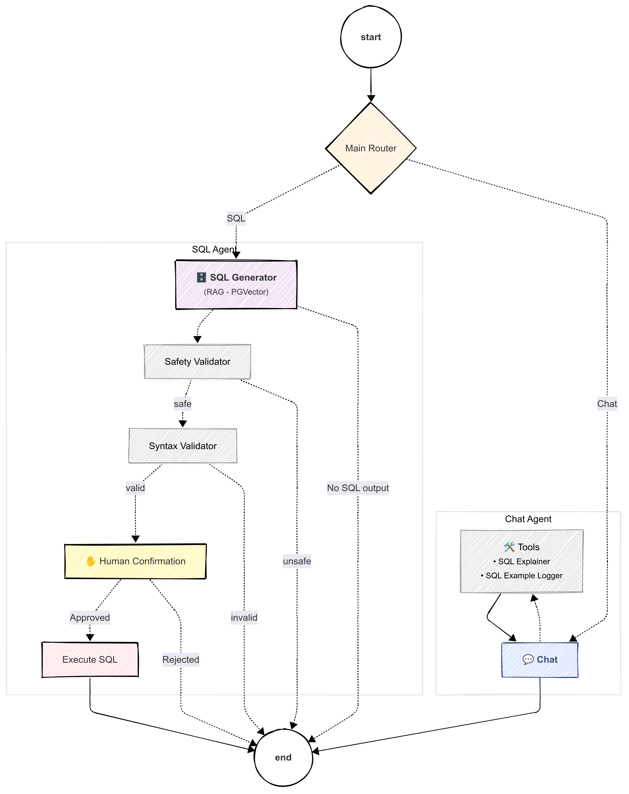

# Natural Language to SQL (NL2SQL Agent)

This project implements a session-based, RAG-powered AI agent that translates natural language into SQL queries for live querying of PostgreSQL databases. It leverages LangChain, LangGraph, PGVector, and modern agentic patterns with production-quality tooling.

## ✨ Key Features

A fully working solution you can adapt to your own datasets:

✅ **LangGraph Orchestration**: Using the latest API references for robust agent workflows  
✅ **Smart Routing**: Intelligent switching between SQL and ReAct-style chat agents  
✅ **RAG with PGVector**: Retrieve few-shot SQL examples based on user aqueries  
✅ **Comprehensive Guardrails**: Validation and human-in-the-loop approval  
✅ **Session Memory**: Token/cost tracking with LangSmith integration  
✅ **End-to-End Flow**: From schema ingestion to query execution on live databases  
✅ **Production Ready**: Built with modern Python tooling and real-world considerations

## 🏗️ Architecture



The system intelligently routes user queries through specialized agents:

- **SQL Agent**: Handles database queries with RAG context retrieval
- **Chat ReAct Agent**: Manages conversational interactions with custom tools

## 🛠️ Tech Stack

| Layer         | Tools & Libraries                                        |
|---------------|----------------------------------------------------------|
| AI / Agents   | `LangGraph`, `LangChain`, `Z.ai GLM` (`GLM-4-Flash`, `GLM-4-Air`) |
| Retrieval     | `PGVector`, SQL context + query embeddings  |
| Database      | `PostgreSQL`, `SQLAlchemy`, `psycopg`       |
| Dev Tooling   | `uv`, `Ruff`, Python 3.12+                  |
| Monitoring    | `LangSmith`                                 |
| Deployment    | `FastAPI`, `Docker`                         |

## 🚀 Quick Start

### Prerequisites

Before getting started, you'll need to install the required tools and dependencies.  
See the [prerequisites](docs/prerequisites.md) for detailed installation instructions.

**Required:**

- [Git](https://git-scm.com/) for cloning the repository
- [UV](https://docs.astral.sh/uv/getting-started/installation/) for Python project management
- PostgreSQL client libraries to query the database
- [Docker](https://www.docker.com/) *(optional)* for containerized deployment
- A Python IDE of your choice (e.g., VS Code)


### Installation

```bash
# Clone the repository
git clone https://github.com/rohanp12326/natural_language_to_sql.git
cd natural_language_to_sql

# Install dependencies with UV
uv sync

# Set up environment variables
cp .env.example .env
# Edit .env with your API keys and database credentials
```

## 📚 Documentation

- [Prerequisites](docs/prerequisites.md)
- [n8n Integration Guide](docs/n8n.md)

## 🙏 Acknowledgments

- Olist Brazilian E-Commerce dataset contributors
- LangChain and LangGraph communities
